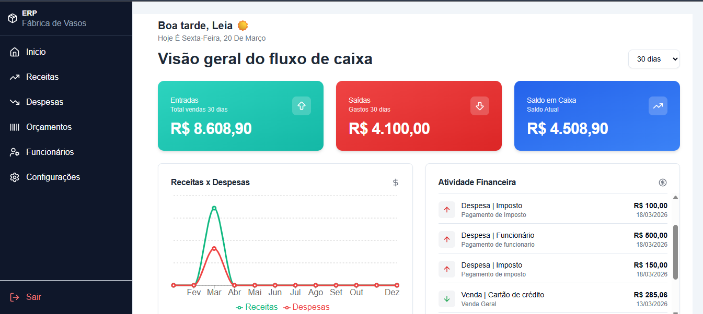
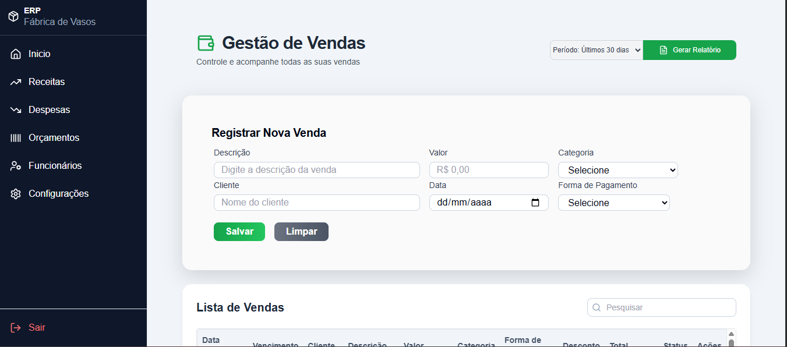
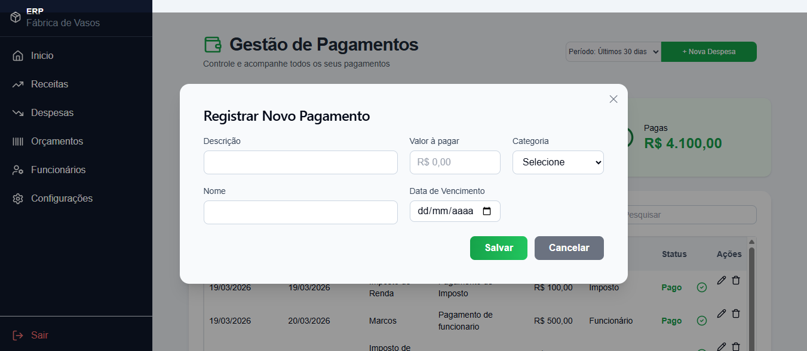

# 💰 ERP – Sistema de Gestão de Caixa

Sistema web para controle financeiro de pequenas empresas: registra receitas e despesas, calcula automaticamente as taxas de cada forma de pagamento, gera orçamentos e relatórios em PDF e mostra tudo em um dashboard com gráficos.

Pensado para quem controla o fluxo de caixa no dia a dia e precisa saber, de forma rápida, quanto entrou, quanto saiu e o que ainda está em aberto.

---

## 📸 Telas

| Dashboard | Receitas | Despesas |
|---|---|---|
|  |  |  |

---

## 📊 Funcionalidades

- **Login** de usuários
- **Dashboard financeiro** com gráficos de receitas e despesas
- **Receitas:** cadastro, edição e exclusão, com cálculo automático das taxas por forma de pagamento
  - Cartão de crédito: taxa de 4,98% + 1% por parcela adicional
  - Cartão de débito: taxa de 1,69%
  - Boleto: vencimento padrão de 7 dias e status "Em aberto"
- **Despesas:** controle de vencimento, pagamento e status
- **Funcionários:** cadastro completo (cargo, salário, admissão e demissão)
- **Orçamentos:** montagem com produtos, itens e frete, com geração de PDF
- **Relatórios em PDF** de movimentação
- **Configurações:** dados da empresa (com logo) e do usuário

---

## 🛠️ Tecnologias

| Camada | Tecnologias |
|---|---|
| Backend | Python, Flask, Flask-CORS, SQLite |
| Frontend | React, Vite, TailwindCSS, shadcn/ui, Recharts, React Router |
| Relatórios | jsPDF, jsPDF-AutoTable |
| Ferramentas | Git, GitHub, Node.js |

---

## 🗂️ Estrutura do projeto

```
ERP---Sistema-de-Caixa/
├── Backend/
│   ├── app.py              # API REST (Flask)
│   ├── meuBd.py            # Script de criação das tabelas
│   ├── meu_banco.db        # Banco SQLite
│   └── app/requirements.txt
├── frontend/
│   └── src/
│       ├── paginas/        # Login, Dashboard, Receitas, Despesas, Funcionários, Orçamento
│       ├── components/     # Gráficos, sidebar e componentes de interface
│       └── Layout/
└── imagem/                 # Prints usados neste README
```

O banco tem 9 tabelas: `usuarios`, `categorias`, `funcionarios`, `receitas`, `despesas`, `empresa`, `produtos`, `orcamentos` e `itens_produtos`.

---

## 🔌 Principais endpoints da API

| Recurso | Métodos | Rota |
|---|---|---|
| Login | `POST` | `/login` |
| Usuários | `GET` `POST` `PUT` `DELETE` | `/usuarios`, `/usuarios/<id>`, `/usuarios/<id>/senha` |
| Receitas | `GET` `POST` `PUT` `DELETE` | `/receitas`, `/receitas/<id>` |
| Despesas | `GET` `POST` `PUT` `DELETE` | `/despesas`, `/despesas/<id>` |
| Funcionários | `GET` `POST` `PUT` `DELETE` | `/funcionarios`, `/funcionarios/<id>` |
| Produtos | `GET` `POST` | `/produtos` |
| Orçamentos | `GET` `POST` | `/orcamentos`, `/orcamentos/<id>/itens` |
| Empresa | `GET` `POST` `PUT` | `/empresa`, `/empresa/<id>` |
| Categorias | `GET` | `/categorias` |

---

## ⚙️ Como executar

**Pré-requisitos:** Python 3.10+, Node.js 20+ e Git.

### 1. Clonar o repositório

```bash
git clone https://github.com/Marydev23/ERP---Sistema-de-Caixa.git
cd ERP---Sistema-de-Caixa
```

### 2. Rodar o backend

```bash
cd Backend
python -m venv venv
source venv/bin/activate        # no Windows: venv\Scripts\activate
pip install -r app/requirements.txt
python app.py
```

A API sobe em `http://localhost:5000`. O repositório já inclui um banco SQLite (`Backend/meu_banco.db`).

### 3. Rodar o frontend

Em outro terminal:

```bash
cd frontend
npm install
npm run dev
```

Acesse o endereço mostrado no terminal (normalmente `http://localhost:5173`).

### 4. Fazer login

Use um usuário já cadastrado no banco ou crie um novo enviando uma requisição `POST` para `http://localhost:5000/usuarios` (por exemplo, pelo Postman):

```json
{
  "Nome": "Seu Nome",
  "Email": "seu@email.com",
  "Senha": "sua-senha"
}
```

---

## 🚧 Próximos passos

- Autenticação com token (JWT) e senhas com hash
- Testes automatizados
- Containerização com Docker
- Deploy para acesso online

---

## 👩‍💻 Autora

**Marilza de Souza Santos**
[LinkedIn](https://www.linkedin.com/in/marilzadesouza) · [GitHub](https://github.com/Marydev23)
